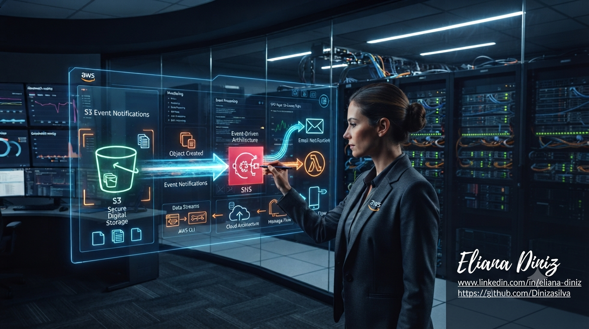
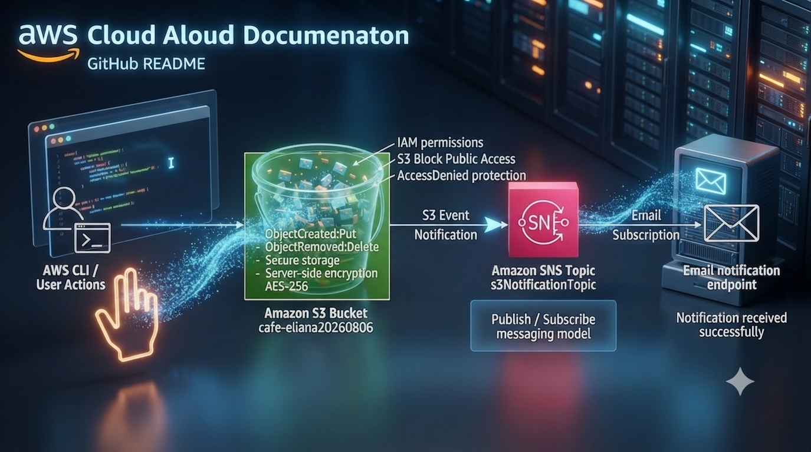

## AWS-S3-Event-Notifications-SNS

<p align="center">


</p>

status:

Documentation Complete
English | Portuguese
Cloud Project


<p align="center">
  
</p>

## Serviços AWS:

AWS Cloud
Amazon S3
Amazon SNS
AWS CLI
IAM

## Project Overview

This project demonstrates the implementation of an event-driven notification architecture using AWS managed services.

The solution configures an Amazon S3 bucket to generate event notifications when objects are created or removed. These events are delivered through Amazon SNS and consumed through an email subscription.

The entire workflow was validated using AWS CLI commands executed from an EC2 CLI Host instance.

---

### Architecture Flow

<p align="center">
  
</p>


## Objectives

The goal of this laboratory was to:

- Create and configure Amazon S3 event notifications.
- Integrate Amazon S3 with Amazon SNS.
- Configure email subscriptions.
- Validate object creation events.
- Validate object deletion events.
- Test security restrictions using AWS IAM permissions.
- Use AWS CLI to automate S3 operations.

---

## AWS Services Used

| Service         | Purpose                                    |
|---              |---                                         |
| Amazon S3       | Object storage and event generation        |
| Amazon SNS      | Message delivery and notification service  |
| Amazon EC2      | CLI Host environment                       |                       
| AWS IAM         | Identity and permission management         |
| AWS CLI         | Command-line automation                    |

---

## Implementation Steps

## 1. Amazon SNS Topic Creation

Created an SNS topic

s3NotificationTopic


Configuration:

Type: Standard
Protocol: Email
Status: Confirmed

The email subscription was confirmed successfully.

---

### 2. S3 Event Notification Configuration

Configured Amazon S3 to send notifications for:

✅ Object creation  
✅ Object deletion

Events:
ObjectCreated:Put
ObjectRemoved:Delete

---

### 3. AWS CLI Configuration

Configured AWS CLI using the IAM user credentials:

```bash
aws configure

Validated identity:
aws sts get-caller-identity

### 4.Testing Object Upload Event

Uploaded an object:

aws s3api put-object \
--bucket cafe-eliana20260806 \
--key images/Caramel-Delight.jpg \
--body ~/new-images/Caramel-Delight.jpg

Result:

{
 "ETag": "\"31ac30da619244b0ce786f106e4f3df7\"",
 "ServerSideEncryption": "AES256"
}

Event generated:
ObjectCreated:Put

### 5. Testing Object Retrieval

Executed:

aws s3api get-object \
--bucket cafe-eliana20260806 \
--key images/Donuts.jpg \
Donuts.jpg

Observation:

No notification was generated because GET operations were not configured as S3 events.

### 6. Testing Object Deletion Event

Executed:

aws s3api delete-object \
--bucket cafe-eliana20260806 \
--key images/Strawberry-Tarts.jpg

Event generated:

ObjectRemoved:Delete

SNS delivered the notification successfully by email.

## Security Validation

Attempted to make an object public:

aws s3api put-object-acl \
--bucket cafe-eliana20260806 \
--key images/Donuts.jpg \
--acl public-read

Expected result:

AccessDenied

Reason:

BlockPublicAcls setting in S3 Block Public Access

This confirmed that public ACL permissions were blocked.

## Key Learnings

Through this project I practiced:

Event-driven architecture concepts
Amazon S3 notifications
SNS publish/subscribe model
AWS CLI automation
IAM permission management
S3 security best practices
Server-side encryption

## Final Architecture


## Author

Eliana Diniz
linkedin: www.linkedin.com/in/eliana-diniz

Cloud Computing Student | AWS Cloud Practitioner Path

⭐ This project was developed as part of hands-on AWS Cloud training.


